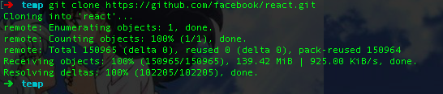
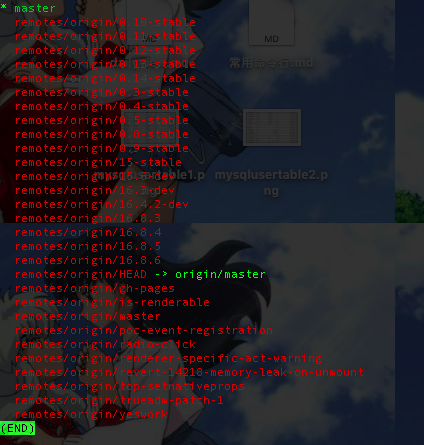
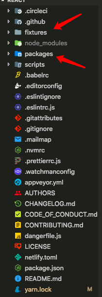
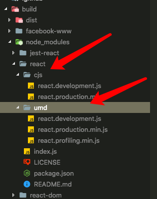
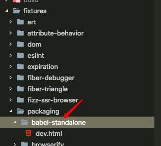
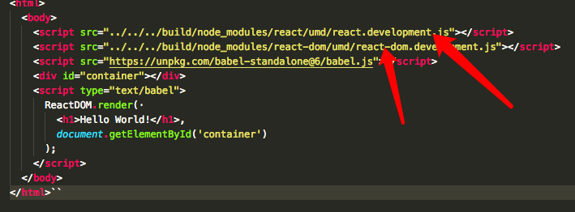
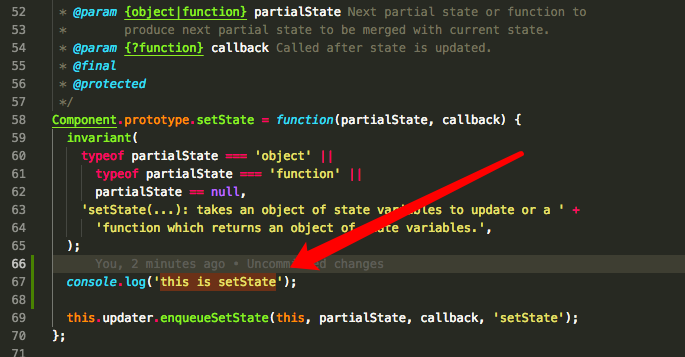
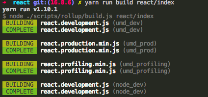
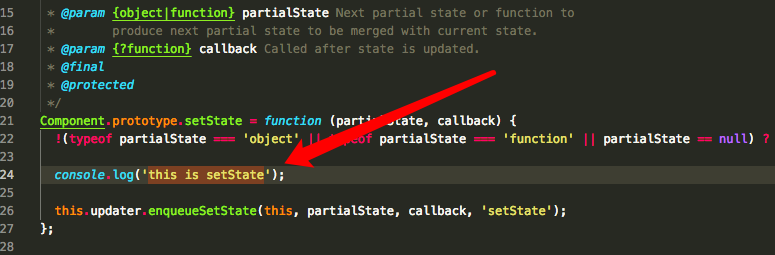

react源码导出
====================

1.从github克隆react源码到本地
>git clone https://github.com/facebook/react.git

2.查看分支，`git branch -a`

3.项目目录如图

4.安装react依赖，没有安装yarn的先安装yarn，`yarn install`

5.从源码编译出`react.development` and `react-dom.development.js`
>yarn run build react/index,react-dom/index

6.构建出的文件，保存在 build/node_modules/react，有 commonjs 和 umd 两个版本。

7.直接打开 `fixtures/packaging/babel-standalone/dev.html`

8.页面使用的是最新编译出来的 `react.development.js` 和 `react-dom.development.js`

更改代码测试效果
=============================

1.在 setState 内部添加一个 log，更改 `packages/react/src/ReactBaseClasses.js`。

2.重新编译 react ，`yarn run build react/index`

3.查看 react.development.js，在 `build/node_modules/react/umd/react.development.js`

至此，代码编译都已经成功了。
